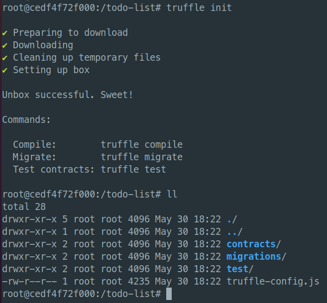
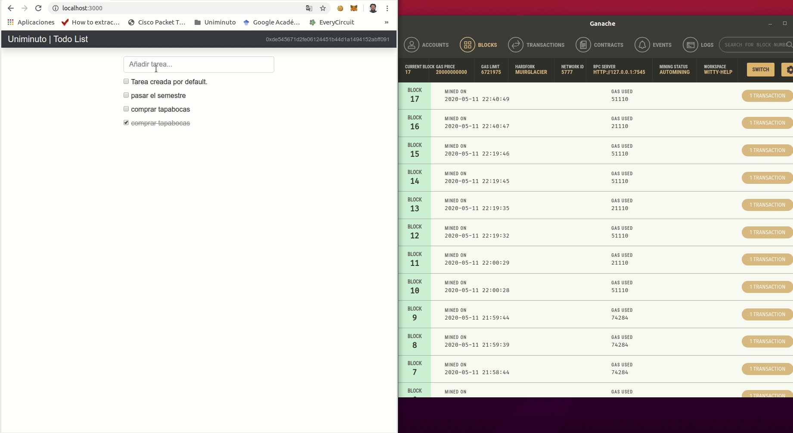

# ToDo List basado en Ethereum smart contracts

_Construyendo una aplicación web de Lista de Quehaceres (ToDo List)_

## Prerequisitos 🛠️

* [NodeJS](https://nodejs.org/es/) - El framework web usado
* [Ganache](https://www.trufflesuite.com/ganache) - Ethereum blockchain personal.

    Ganache es una herramienta de desarrollo local que se puede utilizar para imitar el comportamiento de una blockchain pública. Recomiendo usar Ganache como su blockchain personal para el desarrollo de Ethereum. Permite implementar contratos inteligentes, desarrollar aplicaciones y ejecutar pruebas. ¡Está disponible en Windows, Mac y Linux como una aplicación de escritorio y una herramienta de línea de comandos!

* [Truffle Framework](https://www.trufflesuite.com/) - Testing framework and asset pipeline for blockchains using the Ethereum Virtual Machine (EVM)

    Truffle Framework, provee un conjunto de herramientas para desarrollar Ethereum smart contacts con el lenguaje de programación Solidity.

* [Metamask](https://metamask.io/) - A crypto wallet & gateway to blockchain apps

    MetaMask es una extension para acceder aplicaciones distrubuidas sobre Ethereum, o "Dapps" desde Chrome browser!

    La extension injecta la API de web3 de Ethereum a cada contexto javascript del sitio web, para que las Dapps puedan leer la blockchain.

## Comenzando 🚀

Este proyecto se desarrolla sobre Ubuntu, por lo que esta guia asume que se está utilizando un sistema basado en UNIX

## Instalación 🔧

Para realizar la instalación de prerequisitos se pueden seguir los 


* nodeJs

```console
sudo apt install nodejs npm
```

* Truffle Framework

```console
npm install -g truffle@5.0.2
```

* Ganache

    Descargar la AppImage 

    https://github.com/trufflesuite/ganache/releases/download/v2.4.0/ganache-2.4.0-linux-x86_64.AppImage

* Metamask

    Instalar la extensión desde la Chrome Web Store 

    https://chrome.google.com/webstore/detail/metamask/nkbihfbeogaeaoehlefnkodbefgpgknn

## Configuración del proyecto

Iniciamos con la creación del directorio paara el proyecto

```console
$ mkdir todo-list
$ cd todo-list
```

Dentro del directorio se inicializa un proyecto de Truffle

```console
$ truffle init
```



## Ejecutando las pruebas ⚙️

```shell
truffle test
```

## Despliegue 📦

ToDo

## PoC 



## Autores ✒️

* **Oscar Martínez** - [github](https://github.com/omartinex)

## Licencia 📄

Este proyecto está bajo la Licencia GNU General Public License v3.0 - mira el archivo [LICENSE.md](LICENSE.md) para detalles

## Expresiones de Gratitud 🎁

* Comenta a otros sobre este proyecto 📢
* Invita una cerveza 🍺 o un café ☕ a alguien del equipo.


---
⌨️ con ❤️ por [omartinex](https://github.com/omartinex) 😊